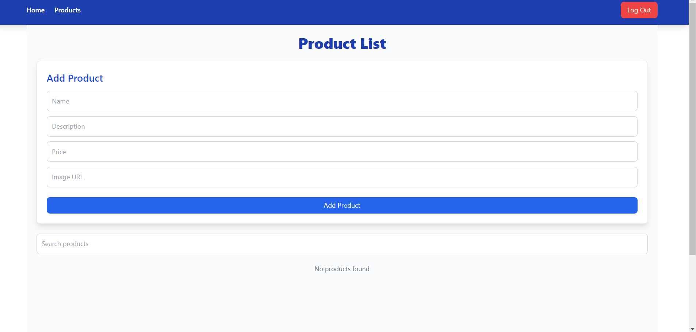
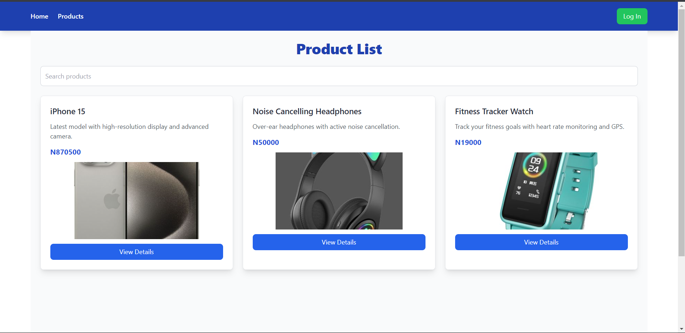
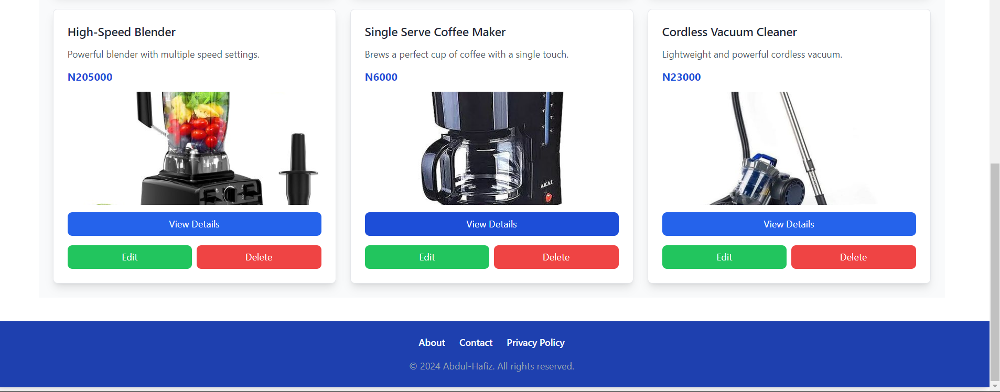
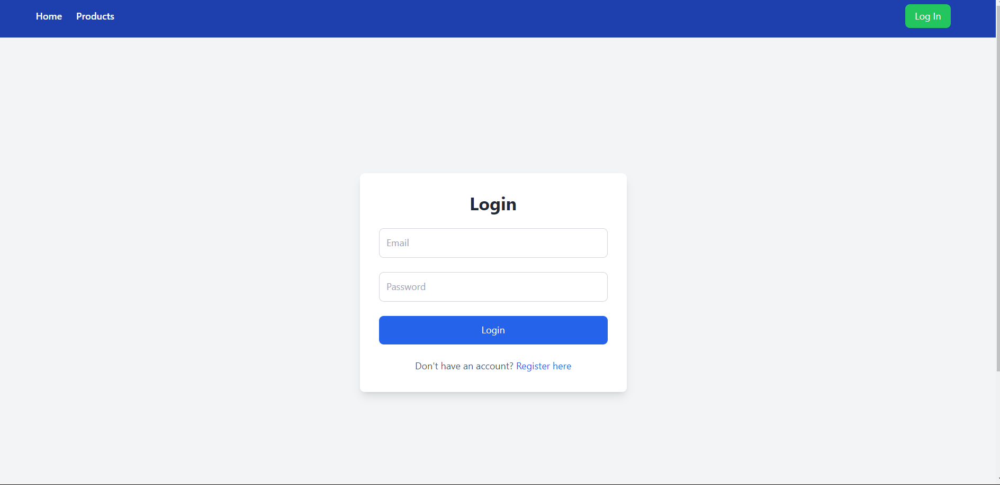
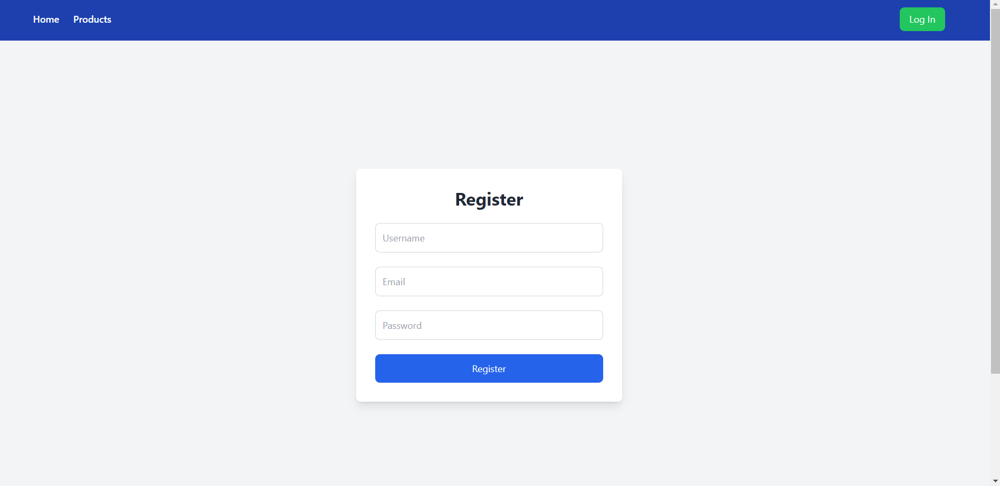

# The Ecom App

This is a take home assignment given to me by LearnlyApp Edtech. The assignment was to build a simple e-commerce product listing application.

[See it live here.](https://learnly-ecommerce-frontend.onrender.com)

## Technologies Used

- Frontend: Vue.js (Composition API), Vue Router, Vuex, Tailwind CSS, Axios
- Backend: Node.js, Express, JWT (JSON Web Tokens)
- Database: MongoDB with Mongoose

## Screenshots

